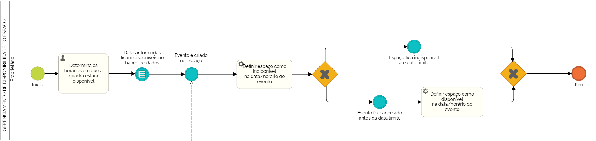
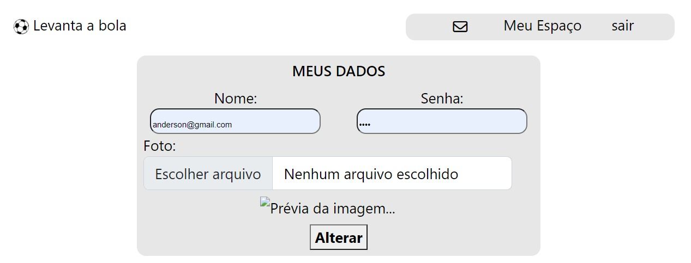

# LEVANTA A BOLA


**Amanda Moura de Souza, amanda.souza.1381861@sga.pucminas.br**

**Letícia Teixeira Lott Carvalho, llott1710@gmail.com**

**Pedro Ramos Vidigal, pedro12vidigal@gmail.com**

**Vítor de Figueiredo Pereira, vitorfigueiredopereira@gmail.com**

**Vitor Nunes Calhau, vnunescalhau@gmail.com**

---

Professores:

**Cleiton Silva Tavares**

**Felipe Augusto Lima Reis**

**Hugo Bastos de Paula**

**Cristiano Neves Rodrigues**

---

_Curso de Engenharia de Software, Unidade Praça da Liberdade_

_Instituto de Informática e Ciências Exatas – Pontifícia Universidade de Minas Gerais (PUC MINAS), Belo Horizonte – MG – Brasil_

---

_**Resumo:**_ Atualmente, percebe-se, no mercado brasileiro, a ausência de uma plataforma capaz de conectar atletas, entusiastas de esportes e professores de Educação Física a fim de agendarem partidas ou juntarem-se a uma equipe. Diante disso, a aplicação 'Levanta a Bola' tem o objetivo de oferecer, de forma fácil e intuitiva, um espaço digital para planejar jogos em diversas modalidades, disponibilizando os diversos espaços esportivos presentes no país, bem como a opção de formar times para um evento. Paralelamente, nossa ferramenta busca atingir o potencial empreendedor de diversos negócios ao possibilitar o melhor uso de infraestrutura esportiva antes não aproveitada.

---


## 1. Introdução

Muito se fala sobre a evidente importância da atividade física para o ser humano. Na atualidade, apesar de grande parte da população possuir interesse por esportes, percebe-se alguns fatores que dificultam a prática destes, sobretudo a falta de espaços adequados e a dificuldade de se formar equipes para partidas. Paralelo à esse problema, verifica-se, nas cidades, uma expressiva quantidade de ambientes esportivos privados que não são aproveitados em todo seu potencial, visto que as ferramentas que viabilizam, de forma específica, a monetização desses negócios são escassas.

Assim, surgiu a necessidade de criar uma plataforma de relevância para solucionar, de forma integrada e intuitiva, os problemas descritos. O 'Levanta a Bola' se apresenta como a solução para as necessidades de jogadores e proprietários de estabelecimentos esportivos, propondo conectá-los para beneficiar mutuamente 
ambas as partes.

    1.1 Contextualização 

Atualmente, já foi comprovado cientificamente que realizar atividades físicas é de extrema importância para manter-se saudável, porém muitas pessoas não tem companhia, tempo ou motivação para praticá-las. Além disso, muitos espaços esportivos privados são exclusivos a clubes e os espaços esportivos públicos nem sempre se encontram em boas condições para uso.

    1.2 Problema

Sob a ótica do empreendedorismo, verifica-se, na atualidade que existe pouco aproveitamento dos espaços esportivos privados pela ótica tecnológica, assim falta uma otimização de seu uso e gerenciamento. Tal fato se dá à medida que clubes, escolas e outros negócios detentores de infraestrutura esportiva vivenciam períodos em que quadras, campos, piscinas e salões se encontram desocupados. Diante disso, surge um problema que é a falta de divulgação destes horários livres e a falta de pessoas para ocuparem estes espaços nestes momentos.

    1.3 Objetivo geral

Desenvolver um software que facilite e automatize o contato entre jogadores que querem buscar um local esportivo, ou uma equipe e os proprietários que possuem esses espaços disponíveis.

        1.3.1 Objetivos específicos

- Facilitar que pessoas interessadas em praticar esportes encontrem partidas independente da modalidade e número de jogadores desejados. Isso será feito criando uma ligação entre os jogadores, e dos jogadores com donos de quadra.
- Possibilitar que donos de espaços recreativos usufruam de 100% da capacidade de aproveitamento do ambiente, de forma que ele possa disponibilizar a quadra para uma ou mais pessoas por um determinado espaço de tempo, cobrando uma taxa pelo aluguel de sua propriedade.

        1.4 Justificativas

De acordo com o Uol, em Março de 2022 [1.1], grande parte das pessoas que praticam atividades físicas regulares relatam a falta de tempo como um dos principais empecilhos para não se exercitarem tanto quanto gostariam. Além disso, a Agência de Notícias do IBGE divulgou [1.2] que, entre 91 milhões de brasileiros, 38,2% alegam falta de tempo e espaço como razão para nunca terem praticado esportes.

Diante da eminência da dificuldade de se encontrar tempo e espaços para realização de práticas esportivas, surge a necessidade de se superar tais desafios, fato se que agrava à medida que não existem, no mercado brasileiro, ferramentas que proponham uma solução integrada para tais empecilhos. 

## 2. Participantes do processo

Altetas amadores: Os atletas e jogadores irão realizar o agendamento de partidas e montar suas equipes.

Proprietários de espaços recreativos: Os proprietários irão monetizar seus espaços, e fornecer para os jogadores e atletas o ambiente necessário para eles jogarem.

## 3. Modelagem do processo de negócio

## 3.1. Análise da situação atual

O processo para se organizar a prática de um esporte coletivo parte da reunião de pessoas interessadas para a montagem de time. Após isso, busca-se o local e agenda sua locação com o proprietário do ambiente esportivo, que deve checar a disponibilidade de seu espaço para o jogo no dia e horário escolhidos pelo criador do evento.

Atualmente, existem aplicativos como o WebQuadras e o QuadraFácil, que são voltados para a organização dos processos de proprietários de quadras. Para reunir jogadores, há o app Chega+, que foca somente em confirmação de presença em partidas de futebol. Não se encontra, no mercado, sistemas únicos que integram a junção de pessoas interessadas em participar de jogos com proprietários de espaços esportivos.

## 3.2. Descrição Geral da proposta

A proposta do projeto 'Levanta a Bola' é, a princípio, atender às necessidades relacionadas de jogadores e proprietários de espaços esportivos.

Para os donos de quadras, campos, salões, piscinas e outros espaços, a aplicação busca oferecer maior visibilidade ao negócio ao conectá-lo às demais pessoas de interesse. Nesse sentido, a principal funcionalidade a ser disponibilizada na aplicação permitirá aos usuários o agendamento de partidas diretamente em tais locais, permitindo aos potenciais clientes encontrar facilmente os locais cadastrados, bem como facilitando ao dono do estabelecimento o processo de administração de solicitações. Dessa forma, maximizar-se-á o arrecadamento desses negócios, visto que este está intrisecamente relacionado à quantidade de clientes que usufruem dos espaços.

Contudo, ainda existem limitações no que se refere à automatização do processo de gerenciamento de negócios, visto que não haverá funcionalidades relacionadas a transações e pagamentos, tendo em vista a criticidade de tais operações e o cunho fictício do projeto.


## 3.3. Modelagem dos Processos

### 3.3.1 Processo 1 – LOGIN/CADASTRO

Processo de criação de uma conta no site, ou de login do usuário. Se o usuário não possuir uma conta ele informa email, cpf, senha da conta e se usará a conta como jogador ou como proprietário de um espaço esportivo, após isso o sistema verifica se os dados são validos, se sim a conta é criada, se não é exibida uma mensagem de erro. Se o usuário possuir uma conta, o mesmo informa seus dados e o sistema verifica se os dados estão corretos, se sim é efetuado o login, se não é exibida uma mensagem de erro.


### 3.3.2 Processo 2 – REALIZAÇÃO DO EVENTO

Processo em que um usuário pode criar um novo evento na plataforma. Após definir informações sobre o evento a ser realizado, é enviada uma solicitação do aluguel de espaço ao proprietário do local. Sendo concedida a solicitação, o evento é criado e ocorrerá mediante atingimento da quantidade mínima definida de jogadores ingressantes.


### 3.3.3 Processo 3 – CRIAÇÃO DO ESPAÇO ESPORTIVO

Processo de criação de um espaço esportivo para ser visto por outros usuários. Após o proprietário informar dados e enviar documentos, tais informações seguem para aprovação de um administrador do sistema. Caso seja aprovado, o espaço é cadastrado, tornando-se visível para os usuários na aplicação. Esse processo existe apenas para usuários cadastrados como proprietários.


### 3.3.4 Processo 4 – GERENCIAMENTO DE DISPONIBILIDADE DO ESPAÇO

Processo que permite o proprietário do espaço pré estabeleça horários na semana em que o ambiente estará disponível para aluguel, conforme o proprietário aceitar a solicitação de ocupação do local ele não aparecerá mais para ser usado na busca por quadras. Após a concretização do jogo ele será classificado como disponível novamente e aparecera na busca.




### 3.3.5 Processo 5 – PARTICIPAR DE UM EVENTO

Processo que descreve a participação de um evento da busca de jogos existentes até a resposta de retorno do criador do evento escolhido. O processo se inicia com um usuário interessado em jogar e passa pela avaliação do criador do evento e devolve a resposta para o jogador.


## 4. Projeto da Solução

### 4.1. Detalhamento das atividades

Descrever aqui cada uma das propriedades das atividades de cada um dos processos. Devem estar relacionadas com o modelo de processo apresentado anteriormente.

#### Processo 1 – LOGIN/CADASTRO

**Informar e-mail e senha**

| **Campo** | **Tipo** | **Restrições** | **Valor default** |
| --- | --- | --- | --- |
| login | Caixa de Texto | formato de e-mail |  |
| senha | Caixa de Texto | mínimo de 8 caracteres |   |

**Fazer cadastro**

| **Campo** | **Tipo** | **Restrições** | **Valor default** |
| --- | --- | --- | --- |
| email | Caixa de Texto | formato de e-mail |  |
| cpf | Número | 11 caracteres |  |
| senha | Caixa de Texto | mínimo de 8 caracteres |   |
| jogador ou proprietário | Múltipla escolha | uma única opção |  |

#### Processo 2 – REALIZAÇÃO DO EVENTO

**Informar data para evento e cidade**

| **Campo** | **Tipo** | **Restrições** | **Valor default** |
| --- | --- | --- | --- |
| Data | Data | Dias a partir da data atual | NULL |
| Cidade | Caixa de texto | Máximo de 35 caracteres | NULL |

**Definir modalidade e informações do evento**

| **Campo** | **Tipo** | **Restrições** | **Valor default** |
| --- | --- | --- | --- |
| Modalidade | Seleção única | Obrigatório |  |
| Quantidade mínima de jogadores | Número |  | 0 |
| Quantidade máxima de jogadores | Número | Obrigatório |  |
| Descrição | Área de texto | Máximo de 200 caracteres. Obrigatório |  |

**Escolher resultado da solicitação**

| **Campo** | **Tipo** | **Restrições** | **Valor default** |
| --- | --- | --- | --- |
| Alugar | Seleção única | Obrigatório | falso |

#### Processo 3 – CRIAÇÃO DO ESPAÇO ESPORTIVO

**Informar dados do espaço**

| **Campo** | **Tipo** | **Restrições** | **Valor default** |
| --- | --- | --- | --- |
| Título | Área de texto | Limite de 30 caracteres; obrigatório |  |
| Descrição | Campo de texto | Limite de 150 caracteres | NULL |
| Estado | Seleção única | Menu dropdown; obrigatório  |  |
| Cidade | Área de texto | Limite de 20 caracteres; obrigatório |  |
| Endereço | Área de texto | Limite de 30 caracteres; obrigatório |  |
| Modalidades suportadas | Múltipla escolha | Mínimo de 1 opção, máximo de 4 opções; multivalorado; obrigatório |  |
| Tamanho | Número | Valor em metros; obrigatório |  |

**Upload de documento do imóvel**

| **Campo** | **Tipo** | **Restrições** | **Valor default** |
| --- | --- | --- | --- |
| Documento | Arquivo | Formato .pdf  |  |

#### Processo 4 – GERENCIAMENTO DE DISPONIBILIDADE DO ESPAÇO

**Informar datas e horários disponíveis para o uso da quadra**

| **Campo** | **Tipo** | **Restrições** | **Valor default** |
| --- | --- | --- | --- |
| Data | Caixa de texto | Valores válidos de dia, mês e ano dentro do formato data (de dd/mm/aa) |  |
| Horário | Caixa de texto | Valores válidos de horas e minutos dentro do formato horário (de 00:00 a 00:00) |  |

#### Processo 5 – PARTICIPAR DE UM EVENTO

**Informar dados da partida**

| **Campo** | **Tipo** | **Restrições** | **Valor default** |
| --- | --- | --- | --- |
| Formulário | Formulário com várias seções | Preencher pelo menos um campo |  |
| Cidade | Campo de texto | Máximo 50 letras |  |
| Modalidade | Campo de texto | Máximo 20 letras |  |

**Decidir se aprova a participação**

| **Campo** | **Tipo** | **Restrições** | **Valor default** |
| --- | --- | --- | --- |
| Botão | Botões de decisão | Escolher uma das opções | Não |


### 4.2. Tecnologias

Para implementação da solução, pretende-se utilizar as seguintes tecnologias:
- HTML, CSS e Javascript para desenvolvimento front-end
- Node.js para integração back-end
- MySQL Workbench para o banco de dados local
- Heflo para modelagem BPMN
- Figma para prototipação e identidade visual
- GitHub para gestão de projeto
- Visual Studio Code para produção de código
- Railway.app como webhost

## 5. Modelo de dados


## 6. Indicadores de desempenho

Apresente aqui os principais indicadores de desempenho e algumas metas para o processo. Atenção: as informações necessárias para gerar os indicadores devem estar contempladas no diagrama de classe. Colocar no mínimo 5 indicadores.

Usar o seguinte modelo:

| **Indicador** | **Objetivos** | **Descrição** | **Cálculo** | **Fonte dados** | **Perspectiva** |
| --- | --- | --- | --- | --- | --- |
| Público do site | Avaliação do cumprimento de demandas dos usuários; Manter balanceados os tipos de usuários cadastrados no nosso site | Percentual de pessoas que cadastram como jogador e que cadastram como proprietário |  | Tabela de usuario | Marketing para novos clientes |
| Taxa de aprovação de espaços | Avaliar qualitativamente, nossos usuários que são proprietários dos espaços | Mede % de aprovação das solicitações de criação de espaço por mês |  | Tabela de espaco_esportivo | Integridade dos proprietários |
| Desmpenho dos eventos | Avaliar a qualidade dos eventos que estão sendo realizados | Eventos que alcançaram o mínimo de jogadores por mês |   | Tabelas de evento e evento_has_usuario | Avaliação e crescimento |
| Crescimento do site | Rastrear crescimento e baixas de uso do site | Quantidade de eventos criados por mês |   | Tabela de evento | Avaliação de crescimento |
| Popularidade das modalidades | Melhorar a eficácia da nossa propaganda | Quantidade de eventos criados por modalidade ordenadas por quantidade decrescente |   | Tabela de evento | Marketing para os clientes |

Obs.: todas as informações para gerar os indicadores devem estar no diagrama de classe **a ser proposto**

<br><br>
Público do site: <br>```
select count(proprietario.id) as usuarios_proprietarios, (count(usuario.id) - (select count(proprietario.id))) as usuarios_jogadores``` <br>
```from usuario left join proprietario on usuario.id = proprietario.usuario_id;``` <br><br>


<br><br>
Taxa de aprovação de espaços: <br>
```select month(dt_aprovado) as mes, count(id) as total_espacos, (count(situacao) - (select count(situacao) from espaco_esportivo where situacao = 0 or situacao = -1)) as espacos_confirmados``` <br>
```from espaco_esportivo``` <br>
```group by mes;``` <br><br>


<br><br>
Desmpenho dos eventos: <br>
```select mes, count(mes) as quantidade_de_eventos``` <br>
```from (``` <br>
	```SELECT month(evento.data) as mes, evento_id, min_jogadores, count(evento_id) AS total_usu, max_jogadores``` <br>
    ```FROM evento_has_usuario``` <br>
    ```INNER JOIN evento ON evento_has_usuario.evento_id = evento.id``` <br>
    ```INNER JOIN usuario ON evento_has_usuario.usuario_id = usuario.id``` <br>
    ```where evento_has_usuario.situacao = 1``` <br>
    ```GROUP BY evento_id``` <br>
	```having min_jogadores < total_usu``` <br>
    ```order by data) as sel_de_dentro``` <br>
    ```group by mes;``` <br><br>


<br><br>
Crescimento do site: <br>```select month(data) as mes, count(id) as num_de_eventos``` <br>```from evento``` <br>```where evento.situacao = 1```<br>```group by mes;```<br><br>


<br><br>
Popularidade das modalidades: <br>
```select nome, count(evento.id) as quantidade_de_evento_por_modalidade``` <br>
```from evento right join modalidade on evento.modalidade_id = modalidade.id``` <br>
```group by modalidade.id``` <br>
```order by quantidade_de_evento_por_modalidade desc;``` <br><br>


## 7.Sistema desenvolvido

E um software que possibilita a criação de eventos esportivos, reunindo jogadores e o proprietário de um espaço de uma forma dinâmica para ambas as partes.

- Landing page que possibilita o usuário ir para o modal de login, e criação de perfil.


- Modal de cadastro no qual o usuário informa seus dados e define se ele será proprietário ou jogador.


- Modal de login no qual o usuário informa seus dados e loga em seu perfil.


- Página em que o jogador ou proprietário pode alterar seus dados.


- Página em que o jogador escolhe se ele pretende criar um evento ou participar de um já existente.


- Página em que o proprietário cria um evento com base em suas preferências.


- Página em que o jogador pode procurar jogos para participar de acordo com suas preferências.


- Página em que o proprietário pode alterar a imagem de sua propriedade no site e visualizar as informações do espaço.


- Página em que o proprietário pode alterar os horários em que o espaço estará disponível.


## 8. Conclusão

Letícia Teixeira Lott Carvalho: Acredito que o trabalho foi proveitoso para aplicar os conceitos de Modelagem de Processos de Negócio e de Banco de Dados, aprendidos paralelamente à disciplina. Contudo, para um desempenho ideal e uma carga de trabalho bem dividida entre os membros do grupo, creio que seria interessante que, na disciplina de Trabalho Interdisciplinar, houvesse maior atenção em orientar os alunos sobre a implementação de um servidor e sua conexão com banco de dados e com o front end.

Pedro Ramos Vidgal: Com esse trabalho eu aprendi a utilizar o node.js para o back-end, e aprimorei minhas habilidades em html, css e js. Esse trabalho foi muito desafiador, porém gostei da experiência e estou aguardando o próximo trabalho interdisciplinar.

Vitor Nunes Calhau: A concretização do projeto possibilitou trabalhar diversas habilidades sociais e técnicas, que foram aprimoradas durante o processo, porém senti que meu grupo teve o desempenho prejudicado pela falta de capacitação da puc em prestar auxílio em certas questões específicas, como node.js.

Vítor de Figueiredo Pereira: O trabalho interdisciplinar foi uma experiência enriquecedora em relação à aquisição de repertório. O grande auxílio fornecido pelos membros do grupo para cada um, fez com que diversas habilidades e conhecimentos fossem transmitidos e adquiridos. O aprendizado de uma nova tecnologia, o node.js, para o backend, foi algo engrandecedor no quesito de novas habilidades, assim como a forma de se realizar integração do banco de dados com o backend.

Amanda Moura de Souza: A conclusão que podemos tirar desse trabalho é que de uma forma geral ele acrescentou conhecimentos valiosos para a nossa formação como engenheiros de software, porém não pudemos absorver todo o potencial da matéria por fatores como a falta de pessoas para ajudar com duvidas de código, falta de coerência no que era cobrado por cada professor e a clara falta de capacitação pela instituição para os lecionadores da matéria.


# APÊNDICES

**Colocar link:**

Código: https://github.com/ICEI-PUC-Minas-PPLES-TI/plf-es-2022-2-ti2-0924100-levanta-a-bola/tree/master/src

Artefatos: https://github.com/ICEI-PUC-Minas-PPLES-TI/plf-es-2022-2-ti2-0924100-levanta-a-bola/tree/master/assets

Apresentação final: https://levanta-a-bola.up.railway.app/

Vídeo de apresentação: https://github.com/ICEI-PUC-Minas-PPLES-TI/plf-es-2022-2-ti2-0924100-levanta-a-bola/blob/master/assets/apresentacao_final.mp4


